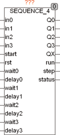
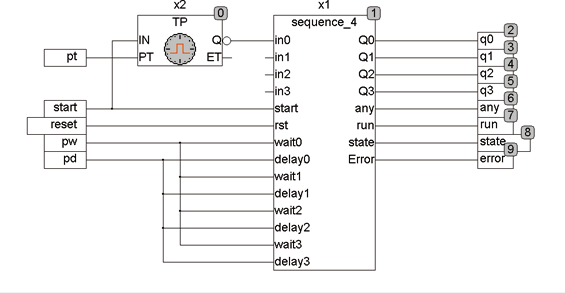

<!--
  Copyright (c) 2026 Hans Mühlbauer, Franz Höpfinger and others.

  This program and the accompanying materials are made available under the
  terms of the Eclipse Public License 2.0 which is available at
  https://www.eclipse.org/legal/epl-2.0

  SPDX-License-Identifier: EPL-2.0
-->

## Type	Function module

| | |
|:---|:---|
| **Input	IN0 .. 3** | BOOL (enable signal for Q0..3) |
| **START** | BOOL (starting edge for the sequencer) |
| **RST** | BOOL (asynchronous reset input) |
| **WAIT 0..3** | TIME (wait for the input signal to 0..3) |
| **DELAY 0..3** | TIME (delay time until the input signal	IN0..3 	is being tested) |
| **Output	Q 0..3** | BOOL (control outputs) |
| **QX** | BOOL (TRUE if one of the outputs Q0..Q3 is active) |
| **RUN** | BOOL (RUN is TRUE if the sequencer is running) |
| **STEP** | INT (indicates the current step) |
| **STATUS** | BYTE (to ESR compliant status output) |
| | SEQUENCE_4 is a 4-bit sequencer with control inputs. After a rising edge on START, RUN gets TRUE and the sequencer waits for the time Wait0 for a TRUE signal at the input IN0. After the signal on IN0 is TRUE, the output Q0 is set and waits the time Delay0. After the interval Delay0 in the next cycle the module waiting the time wait1 for an input signal at in1 and Q0 remains TRUE, until Q1 is set. The whole procedure is repeated until all 4 cycles have elapsed. If during the waiting time wait0..3 the corresponding input gets not true, an error is set, by corresponding  Error  Number at the output STATUS it is displayed, and depending on the setup variable STOP_ON_ERROR the sequencer is stopped or not. The STATUS output is 110 for waiting to the start signal, and 111 for pass through. It show the sequence with 1 .. 4 errors. A  Error  = 1 means that the signal at the input  in0 gets not active, a 2 corresponds to in1 etc.  The outputs RUN and STEP indicate whether the sequencer is running and in which cycle it is at the moment. The output QX is TRUE, if one of the outputs Q0..Q3 are TRUE. |

| | An asynchronous reset input can always reset the sequencer. This reset input can also be connected with a output Q0..Q3 to stop the sequencer before the full sequence. The sequencer can be started at any time with a rising edge on the START input, again and again. This is true, even if he has not completed a sequence. |
| | If not a edge examination of one or more inputs IN are required, they may simply be left open, because the default value for this input is TRUE. |
| | The initial state is compatible and ESR shows a value of 1-4   indicates that an error has occurred. An error occurs if the corresponding input signal to IN does not occur during the waiting period. |
| | Error  = 1 means that in0 is not within the waiting time has become active. Error 2 .. 4 corresponds to inputs 1 .. 3. |
| | A status value of 110 means on hold and 111 means that just a sequence is running. |






**Example:**

```iecst
In the following  Example  is  the sequencer is started with a rising edge. Simultaneously, a pulse generator TP starts with 2 seconds, and that was the starting trigger with 2 seconds delay to the input IN0. The sequencer sets just after the start pulse, the output signal RUN and then waits for a maximum of 5 seconds on a signal to IN0. The rising edge of IN0 that is generated after 2 seconds of TP, Q0 is set and a delay for 1 second is waited. This the first step is finished and the remaining steps are executed without waiting for an input signal in 1..3. The default values for the inputs IN are TRUE when they are unconnected. The trace record shows the start signal (green) and the RUN signal (red). After 2 seconds, the rising edge is putted on the input in0 and then on the output signals Q0..3 and QX. The signal QX (blue) is active if one of the output signals is active and the RUN signal (red) is active from start to finish.
```
