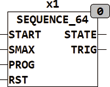

<!--
  Copyright (c) 2026 Hans Mühlbauer, Franz Höpfinger and others.

  This program and the accompanying materials are made available under the
  terms of the Eclipse Public License 2.0 which is available at
  https://www.eclipse.org/legal/epl-2.0

  SPDX-License-Identifier: EPL-2.0
-->

## Type	Function module

| | |
|:---|:---|
| **Input	START** | BOOL (rising edge starts the sequence) |
| | SMAX INT (last  State  the sequence) |
| **PROG** | ARRAY [0..63] OF TIME (duration of the individual  states  ) |
| **RST** | BOOL (asynchronous reset input) |
| **Output	STATE** | INT (  State  Output) |
| **TRIG** | BOOL (Indicates changes with condition TRUE) |
| | SEQUENCE_64 generates a time sequence of up to 64 states. In the resting state the output STATE is set to -1, thereby demonstrating to that the module is not active. A rising edge at START starts the sequence and the output switches to 0. After the waiting time PROG[0] the module switch next to STATE = 1, waits the time PROG[1], switches to STATE = 2, etc. .. until the output STATE reached the value of SMAX. After the waiting time PROG[SMAX], the device returns to the idle state (STATE = -1). A change to a new state STATE trigger of the output TRIG with a TRUE for one PLC cycle. With TRIG easily downstream modules can be controlled. With the input RST, the device can also be reset in the initial state at any time during the process of a sequence. |
| **signal diagram of SEQUENCE_64** |  |

