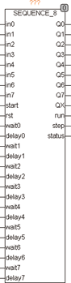

<!--
  Copyright (c) 2026 Hans Mühlbauer, Franz Höpfinger and others.

  This program and the accompanying materials are made available under the
  terms of the Eclipse Public License 2.0 which is available at
  https://www.eclipse.org/legal/epl-2.0

  SPDX-License-Identifier: EPL-2.0
-->

## Type	Function module

| | |
|:---|:---|
| **Input	IN0..7** | BOOL (enable signal for Q0..7) |
| **START** | BOOL (starting edge for the sequencer) |
| **RST** | BOOL (asynchronous reset input) |
| **WAIT 0..7** | TIME (wait for the input signal to 0..7) |
| **DELAY 0..7** | TIME (delay time until the input signal	IN0..7 tested) |
| **Output	Q 0..7** | BOOL (control outputs) |
| **QX** | BOOL (TRUE if one of the outputs Q0.. Q7 is active) |
| **RUN** | BOOL (RUN is TRUE if the sequencer is running) |
| **STEP** | INT (indicates the current step) |
| **STATUS** | BYTE (0 if no error, else > 0) |
| | A functional description of SEQUENCE_8 can be found at SEQUENCE_4. SEQUENCE_8 function is identical with SEQUENCE_4. He has 8 instead of 4 channels.   SEQUENCE_8 is used in the OSCAT library module Legionella. |

