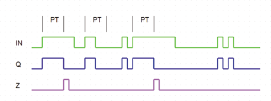

<!--
  Copyright (c) 2026 Hans Mühlbauer, Franz Höpfinger and others.

  This program and the accompanying materials are made available under the
  terms of the Eclipse Public License 2.0 which is available at
  https://www.eclipse.org/legal/epl-2.0

  SPDX-License-Identifier: EPL-2.0
-->

## Type	Function module

| | |
|:---|:---|
| **Input	IN** | BOOL (Input) |
| **PT** | TIME (switch off delay) |
| **Output	Q** | BOOL (output) |
| **Z** | BOOL (  Trigger  Output) |
| | TMAX limits the duration of the output pulse to the time PT. The output Q follows the input IN, as long as the TRUE time of IN is shorter than PT. If IN is longer than PT to TRUE, the output pulse is shortened. Whenever an output changes by a timeout to FALSE, the output Z  is set to TRUE for a cycle. |

