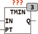

<!--
  Copyright (c) 2026 Hans Mühlbauer, Franz Höpfinger and others.

  This program and the accompanying materials are made available under the
  terms of the Eclipse Public License 2.0 which is available at
  https://www.eclipse.org/legal/epl-2.0

  SPDX-License-Identifier: EPL-2.0
-->

## Type	Function module

| | |
|:---|:---|
| **Input	IN** | BOOL (Input) |
| **PT** | TIME (switch off delay) |
| **Output	Q** | BOOL (output) |
| | TMIN ensures that the output pulse Q is at least PT is set to TRUE, even if the input pulse at IN is shorter than PT. otherwise the output Q follows the input IN. |

