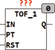
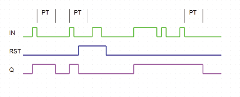

<!--
  Copyright (c) 2026 Hans Mühlbauer, Franz Höpfinger and others.

  This program and the accompanying materials are made available under the
  terms of the Eclipse Public License 2.0 which is available at
  https://www.eclipse.org/legal/epl-2.0

  SPDX-License-Identifier: EPL-2.0
-->

## Type	Function module

| | |
|:---|:---|
| **Input	IN** | BOOL (Input) |
| **PT** | TIME (switch off delay) |
| **RST** | BOOL (asynchronous reset) |
| **Output	Q** | BOOL (output) |
| | TOF_1 extended an input pulse at IN by the time PT. TOF_1 has the same functionality as TOF from the standard LIB, but with an additional asynchronous reset input. |

