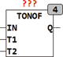
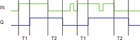

<!--
  Copyright (c) 2026 Hans Mühlbauer, Franz Höpfinger and others.

  This program and the accompanying materials are made available under the
  terms of the Eclipse Public License 2.0 which is available at
  https://www.eclipse.org/legal/epl-2.0

  SPDX-License-Identifier: EPL-2.0
-->

## Type	Function module

| | |
|:---|:---|
| **Input	IN** | BOOL (Input) |
| **T1** | TIME (ON Delay) |
| **T2** | TIME (OFF Delay) |
| **Output	Q** | BOOL (output pulse) |
| | TONOF creates a ON delay T1 and an OFF delay T2 |
| | The rising edge of the input signal IN is delayed by T1 and the falling edge of IN is delayed by T2. |

