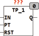
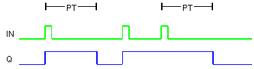

<!--
  Copyright (c) 2026 Hans Mühlbauer, Franz Höpfinger and others.

  This program and the accompanying materials are made available under the
  terms of the Eclipse Public License 2.0 which is available at
  https://www.eclipse.org/legal/epl-2.0

  SPDX-License-Identifier: EPL-2.0
-->

## Type	Function module

| | |
|:---|:---|
| **Input	IN** | BOOL (Input) |
| **PT** | TIME (pulse duration) |
| **RST** | BOOL (asynchronous reset) |
| **Output	Q** | BOOL (output pulse) |
| | TP_1 is an edge-triggered pulse generator which generates a rising edge at IN an output pulse at Q with the duration of PT. During the output pulse an another rising edge to IN is created, the output pulse will be extended so that after the last rising edge of output for the duration of PT remains TRUE. The module can be reset at any time with a TRUE at the RST input. |
| **Timing of TP_1** |  |

