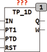

<!--
  Copyright (c) 2026 Hans Mühlbauer, Franz Höpfinger and others.

  This program and the accompanying materials are made available under the
  terms of the Eclipse Public License 2.0 which is available at
  https://www.eclipse.org/legal/epl-2.0

  SPDX-License-Identifier: EPL-2.0
-->

## Type	Function module

| | |
|:---|:---|
| **Input	IN** | BOOL (Input) |
| **PT1** | TIME (pulse duration) |
| **PTD** | TIME (  Delay  can be generated by new pulse) |
| **RST** | BOOL (asynchronous reset) |
| **Output	Q** | BOOL (output pulse) |
| | TP_1D is an edge-triggered pulse generator which generates at a rising edge at IN an output pulse at Q with the duration of PT1. During the output pulse an another rising edge to IN is created, the output pulse will be extended so that after the last rising edge of output for the duration of PT remains TRUE. After the end of the pulse duration PT1 the module block the output for the time PTD. A new impulse can be restarted only after the time PTD. The module can be reset at any time with a TRUE at the RST input. The output W shows that the module in the waiting cycle, and as long as W = TRUE, no new impuls can start. |

