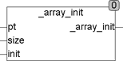

<!--
  Copyright (c) 2026 Hans Mühlbauer, Franz Höpfinger and others.

  This program and the accompanying materials are made available under the
  terms of the Eclipse Public License 2.0 which is available at
  https://www.eclipse.org/legal/epl-2.0

  SPDX-License-Identifier: EPL-2.0
-->

## _ARRAY_INIT

| | |
|:---|:---|
| **Type	Function** | BOOL |
| **Input	PT** | Pointer  (Pointer to the array) |
| **SIZE** | UINT (size of the array) |
| **INIT** | REAL (initial value) |
| **Output** | BOOL (TRUE) |
| **The function _ARRAY_INIT initializes an arbitrary array  of REAL with an initial value. When called, a pointer to the array and its size in bytes is transferred to the function. Under CoDeSys the call reads** | _ARRAY_INIT(ADR(Array), SIZEOF(Array), INIT), where array is the name of the array to be manipulated. ADR() is a standard function which identifies the pointer to the array and SIZEOF() is a standard function, which determines the size of the array. The function only returns TRUE. The array specified by the pointer is manipulated directly in memory. |
| | This type of processing arrays is very efficient because no additional memory is required and no surrender values must be copied. |



**Example:**

```iecst
_ARRAY_INIT(ADR(bigarray), SIZEOF(bigarray), 0) initialized bigarray with 0.
```
