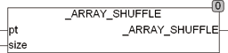

<!--
  Copyright (c) 2026 Hans Mühlbauer, Franz Höpfinger and others.

  This program and the accompanying materials are made available under the
  terms of the Eclipse Public License 2.0 which is available at
  https://www.eclipse.org/legal/epl-2.0

  SPDX-License-Identifier: EPL-2.0
-->

## _ARRAY_SHUFFLE

| | |
|:---|:---|
| **Type	Function** | BOOL |
| **Input	PT** | Pointer (pointer to the array) |
| **SIZE** | UINT (size of the array) |
| **Output** | BOOL (result TRUE) |
| **The function _array  _  SHUFFLE exchanges the elements of an arbitrary array  Of  REAL at random. When called, a Pointer to the array and its size in bytes is transferred to the function. Under CoDeSys is the call** | _ARRAY_SHUFFLE(ADR(Array), SIZEOF(Array)), where array is the name of the array to be manipulated. ADR() is a standard function, which identifies the pointer to the array and SIZEOF() is a standard function, which determines the size of the array. The array referenced by the Pointer  is manipulated directly in memory and is available directly after exit the function. The function _ARRAY_SHUFFLE thus changes the contents of the array. |
| | This type of processing arrays is very efficient because no additional memory is required and no surrender values must be copied. |
| | If an array is processed, which should not be changed, so it has to be copied to a temporary array before handing over the  Pointer  and calling the function. |
| **Output array** | (0,1,2,3,4,5,6,7,8,9) |
| **Results** | (5,0,3,9,7,2,1,8,4,6) |
| | The result is not repeatable, the function returns after each call or even restart a new order. |



**Example:**

```iecst
_ARRAY_SHUFFLE (ADRs(bigarray), SIZEOF(bigarray))
```

A call of the function _ARRAY_SHUFFLE could change an array as follows. Since the function uses a  pseudo  random  algorithm each time the result is different, the results are not reproducible, even through a restart of the program or the programmable logic control (plc).
