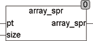

<!--
  Copyright (c) 2026 Hans Mühlbauer, Franz Höpfinger and others.

  This program and the accompanying materials are made available under the
  terms of the Eclipse Public License 2.0 which is available at
  https://www.eclipse.org/legal/epl-2.0

  SPDX-License-Identifier: EPL-2.0
-->

## ARRAY_SPR

| | |
|:---|:---|
| **Type	Function** | REAL |
| **Input	PT** | Pointer  (Pointer to the array) |
| **SIZE** | UINT (size of the array) |
| **Output** | REAL (dispersion of the array) |
| **The function ARRAY_SPR determines the dispersion of an arbitrary array  of REAL. The dispersion is the maximum value in the array minus the minimum value of the array. When called, a Pointer to the array and its size in bytes is transferred to the function. Under CoDeSys the call reads** | ARRAY_SPR(ADR(Array), SIZEOF(Array)), where array is the name of the array to be manipulated. ADR() is a standard function which identifies the pointer to the array and SIZEOF() is a standard function, which determines the size of the array. In order to determine the maximum, the array referenced by the pointer is scanned directly in memory. The function ARRAY_SPR does not change the content of the array. |
| | This type of processing arrays is very efficient because no additional memory is required and no surrender values must be copied. |



**Example:**

```iecst
ARRAY_SPR(ADR(bigarray), SIZEOF(bigarray)) = maximumvalue(bigarray) - minimalvalue(bigarray)
```
