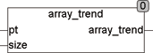

<!--
  Copyright (c) 2026 Hans Mühlbauer, Franz Höpfinger and others.

  This program and the accompanying materials are made available under the
  terms of the Eclipse Public License 2.0 which is available at
  https://www.eclipse.org/legal/epl-2.0

  SPDX-License-Identifier: EPL-2.0
-->

## Type	Function: REAL

| | |
|:---|:---|
| **Input	PT** | Pointer  (Pointer to the array) |
| **SIZE** | UINT (size of the array) |
| **Output** | REAL (development trend of the array) |
| **The function _ARRAY_TREND calculates the trend development of all values of an arbitrary array of REAL. When called a pointer to the array and its size in bytes is passed to the function. Under CoDeSys the call reads** | ARRAY_TREND(ADR(Array), SIZEOF(Array)), where array is the name of the array to be manipulated. ADR() is a standard function, which identifies the pointer to the array and SIZEOF() is a standard function, which determines the size of the array. In order to determine the trend, the array referenced by the pointer is scanned directly in memory. The function ARRAY_TREND does not change the content of the array.  This type of processing arrays is very efficient because no additional memory is required and no surrender values must be copied. The trend is determined by subtract the average of the lower half of the values of the array from the average of the values of the upper half of the array. |



**Example:**

```iecst
[fuzzy] ARRAY_AVG(ADR(bigarray), SIZEOF (bigarray))
```
