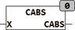

<!--
  Copyright (c) 2026 Hans Mühlbauer, Franz Höpfinger and others.

  This program and the accompanying materials are made available under the
  terms of the Eclipse Public License 2.0 which is available at
  https://www.eclipse.org/legal/epl-2.0

  SPDX-License-Identifier: EPL-2.0
-->

## Type	Function: REAL

| | |
|:---|:---|
| **Input	X** | [COMPLEX](../../Data Types/complex.md)  (Input) |
| **Output** | REAL (result) |
| | CABS calculates the length of the vector of a complex number The absolute value is also module or Magnitude mentioned. |
| | CABS = SQRT(X.RE² + X.IM²) |

