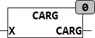

<!--
  Copyright (c) 2026 Hans Mühlbauer, Franz Höpfinger and others.

  This program and the accompanying materials are made available under the
  terms of the Eclipse Public License 2.0 which is available at
  https://www.eclipse.org/legal/epl-2.0

  SPDX-License-Identifier: EPL-2.0
-->

## CARG

| | |
|:---|:---|
| **Type	Function** | REAL |
| **Input	X** | [COMPLEX](../../Data Types/complex.md) (Input value) |
| **Output** | REAL (result) |
| | CARG calculates the angle of a complex number in the coordinate system. |
| | The range of values of the result is between [-π , +π ]. |

