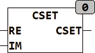

<!--
  Copyright (c) 2026 Hans Mühlbauer, Franz Höpfinger and others.

  This program and the accompanying materials are made available under the
  terms of the Eclipse Public License 2.0 which is available at
  https://www.eclipse.org/legal/epl-2.0

  SPDX-License-Identifier: EPL-2.0
-->

## Type	Function: [COMPLEX](../../Data Types/complex.md)

| | |
|:---|:---|
| **Input	RE** | [COMPLEX](../../Data Types/complex.md)  (Real input) |
| **IM** | REAL (Imaginary input) |
| **Output** | [COMPLEX](../../Data Types/complex.md) (result) |
| | CSET generated from the two input components RE and IM is a complex number of type [COMPLEX](../../Data Types/complex.md). |

