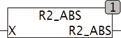

<!--
  Copyright (c) 2026 Hans Mühlbauer, Franz Höpfinger and others.

  This program and the accompanying materials are made available under the
  terms of the Eclipse Public License 2.0 which is available at
  https://www.eclipse.org/legal/epl-2.0

  SPDX-License-Identifier: EPL-2.0
-->

## R2_ABS

| | |
|:---|:---|
| **Type	Function** | [REAL2](../../Data Types/real2.md) |
| **Input	X** | [REAL2](../../Data Types/real2.md)  (Input) |
| **Output** | [REAL2](../../Data Types/real2.md) (result double-precision) |
| | R2_ABS returns the absolute value of x in double precision. |

