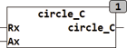
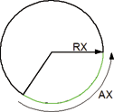

<!--
  Copyright (c) 2026 Hans Mühlbauer, Franz Höpfinger and others.

  This program and the accompanying materials are made available under the
  terms of the Eclipse Public License 2.0 which is available at
  https://www.eclipse.org/legal/epl-2.0

  SPDX-License-Identifier: EPL-2.0
-->

## Type	Function

| | |
|:---|:---|
| **Input	RX** | REAL (circle radius) |
| **RX** | REAL (circle radius) |
| **Output** | REAL (arc length or circumference) |
| | CIRCLE_C calculates the arc length of an arc with the angle AX and radius RX. If the angle is set AX = 360 so the circumference is calculated. |

