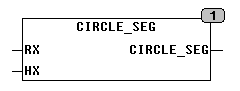
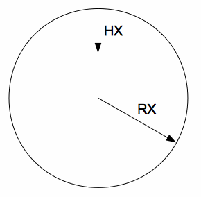

<!--
  Copyright (c) 2026 Hans Mühlbauer, Franz Höpfinger and others.

  This program and the accompanying materials are made available under the
  terms of the Eclipse Public License 2.0 which is available at
  https://www.eclipse.org/legal/epl-2.0

  SPDX-License-Identifier: EPL-2.0
-->

## CIRCLE_SEG

| | |
|:---|:---|
| **Type	Function** | REAL |
| **Input	RX** | REAL	(Circle radius) |
| **HX** | REAL	(Height of Sektantlinie) |
| **Output	Real** | (Area of segment) |
| | CIRCLE_SEG calculates the area of a circle segment is enclosed by a Sektantlinie and the circle. |

