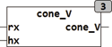

<!--
  Copyright (c) 2026 Hans Mühlbauer, Franz Höpfinger and others.

  This program and the accompanying materials are made available under the
  terms of the Eclipse Public License 2.0 which is available at
  https://www.eclipse.org/legal/epl-2.0

  SPDX-License-Identifier: EPL-2.0
-->

## Type	Function

| | |
|:---|:---|
| **Input	RX** | REAL (radius of base) |
| **HX** | REAL (height of cone) |
| **Output** | REAL (volume of the cone) |
| | KONE_V calculated the volume of a cone with the radius RX and height HX. |

