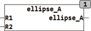

<!--
  Copyright (c) 2026 Hans Mühlbauer, Franz Höpfinger and others.

  This program and the accompanying materials are made available under the
  terms of the Eclipse Public License 2.0 which is available at
  https://www.eclipse.org/legal/epl-2.0

  SPDX-License-Identifier: EPL-2.0
-->

## Type	Function

| | |
|:---|:---|
| **Input	R1** | REAL (radius 1) |
| **R2** | REAL (radius 2) |
| **Output** | REAL (area of the ellipse) |
| | ELLIPSE_A calculates the area of an ellipse that is defined by the radii R1 and R2. |

