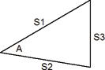

<!--
  Copyright (c) 2026 Hans Mühlbauer, Franz Höpfinger and others.

  This program and the accompanying materials are made available under the
  terms of the Eclipse Public License 2.0 which is available at
  https://www.eclipse.org/legal/epl-2.0

  SPDX-License-Identifier: EPL-2.0
-->

## Type	Function

| | |
|:---|:---|
| **Input	S1** | REAL (side 1) |
| **A** | REAL (angles between page 1 and page 2) |
| **S2** | REAL (side length 2) |
| **S3** | REAL (side length 3) |
| **Output** | REAL (area of the triangle) |
| | TRIANGLE_A calculates the area of any triangle. The triangle can be defined by either through 2 pages and the pages spanned by the angles 1 and 2 (S1, S2 and A), or if A = 0 then the area is calculated from three sides (S1, S2 and S3). |

