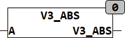

<!--
  Copyright (c) 2026 Hans Mühlbauer, Franz Höpfinger and others.

  This program and the accompanying materials are made available under the
  terms of the Eclipse Public License 2.0 which is available at
  https://www.eclipse.org/legal/epl-2.0

  SPDX-License-Identifier: EPL-2.0
-->

## Type	Function

| | |
|:---|:---|
| **Input	A** | [VECTOR_3](../../Data Types/vector_3.md) (vector with the coordinates X, Y, Z) |
| **Output** | REAL (Absolute length of the vector) |
| | V3_ABS calculates the absolute value (length) of a vector in a three-dimensional coordinate system. |
| | V3_ABS(3,4,5) = 7.071... |

