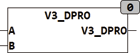

<!--
  Copyright (c) 2026 Hans Mühlbauer, Franz Höpfinger and others.

  This program and the accompanying materials are made available under the
  terms of the Eclipse Public License 2.0 which is available at
  https://www.eclipse.org/legal/epl-2.0

  SPDX-License-Identifier: EPL-2.0
-->

## Type	Function

| | |
|:---|:---|
| **Input	A** | [VECTOR_3](../../Data Types/vector_3.md) (vector with the coordinates X, Y, Z) |
| **B** | [VECTOR_3](../../Data Types/vector_3.md) (vector with the coordinates X, Y, Z) |
| **Output** | REAL (Scalar Product) |
| | V3_DPRO calculates the scalar product of two-dimensional vectors. |
| | V3_DPRO([1,2,3],[3,1,2]) = 11 |
| | The scalar product is calculated from A.X*B.X + A.Y*B.Y + A.Z*B.Z |

