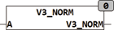

<!--
  Copyright (c) 2026 Hans Mühlbauer, Franz Höpfinger and others.

  This program and the accompanying materials are made available under the
  terms of the Eclipse Public License 2.0 which is available at
  https://www.eclipse.org/legal/epl-2.0

  SPDX-License-Identifier: EPL-2.0
-->

## Type	Function

| | |
|:---|:---|
| **Input	A** | [VECTOR_3](../../Data Types/vector_3.md) (vector with the coordinates X, Y, Z) |
| **Output** | [VECTOR_3](../../Data Types/vector_3.md) (vector with the coordinates X, Y, Z) |
| | V3_NORM generates from any one-dimensional vector a vector Normalized to length 1 with the same direction. A vector of length 1 is called unit vector |
| | V3_NORM(3,0,0) = (1,0,0) |

