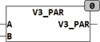

<!--
  Copyright (c) 2026 Hans Mühlbauer, Franz Höpfinger and others.

  This program and the accompanying materials are made available under the
  terms of the Eclipse Public License 2.0 which is available at
  https://www.eclipse.org/legal/epl-2.0

  SPDX-License-Identifier: EPL-2.0
-->

## Type	Function

| | |
|:---|:---|
| **Input	A** | [VECTOR_3](../../Data Types/vector_3.md) (vector with the coordinates X, Y, Z) |
| **B** | [VECTOR_3](../../Data Types/vector_3.md) (vector with the coordinates X, Y, Z) |
| **Output** | BOOL (TRUE if the two vectors are parallel) |
| | V3_PAR will be TRUE if the two vectors A and B are parallel. A zero vector is parallel to any vector because it has no direction. Two vectors A and B in opposite directions are parallel. |
| | V3_PAR([1,1,1],[2,2,2]) = TRUE |
| | V3_PAR([1,1,1],[-1,-1,-1]) = TRUE |
| | V3_PAR([1,2,3],[0,0,0]) = TRUE |
| | V3_PAR([1,2,3],[1,0,0]) = FALSE |

