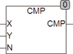

<!--
  Copyright (c) 2026 Hans Mühlbauer, Franz Höpfinger and others.

  This program and the accompanying materials are made available under the
  terms of the Eclipse Public License 2.0 which is available at
  https://www.eclipse.org/legal/epl-2.0

  SPDX-License-Identifier: EPL-2.0
-->

## Type	Function: BOOL

| | |
|:---|:---|
| **Input	X, Y** | REAL (input) |
| **N** | INT (number of digits to be compared) |
| **Output** | BOOL (result) |
| | CMP compares two REAL values if the first N points are equal. |



**Example:**

```iecst
CMP(3.140,3.149,3) = TRUE	CMP(3.140,3.149,4) = FALSE CMP(0.015,0,016,1) = TRUE	CMP(0.015,0,016,2) = FALSE
```

In the CMP function note that the dual coding of numbers a 0.1 in the decimal system can not necessarily always displayed as 0.1 in the binary system. Rather, it may happen that represented something less than 0.1 or greater because the resolution is not the number in binary coding allows exactly one 0.1. For this reason, the function can not detect for 100% the difference of 1 in the last position. In addition, note that a data type REAL with 32 bit has only a resolution of 7 - 8 decimal places.
