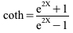

<!--
  Copyright (c) 2026 Hans Mühlbauer, Franz Höpfinger and others.

  This program and the accompanying materials are made available under the
  terms of the Eclipse Public License 2.0 which is available at
  https://www.eclipse.org/legal/epl-2.0

  SPDX-License-Identifier: EPL-2.0
-->

## COTH

| | |
|:---|:---|
| **Type	Function** | REAL |
| **Input	X** | REAL (input) |
| **Output** | REAL (output value) |
| **COTH calculates the hyperbolic cotangent by the following formula** |  |
| | For input values larger than 20 or less than -20 COTH provides the approximate value +1 or -1 corresponding to an accuracy better than 8 digits and is thus below the resolution of type REAL. |

