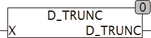

<!--
  Copyright (c) 2026 Hans Mühlbauer, Franz Höpfinger and others.

  This program and the accompanying materials are made available under the
  terms of the Eclipse Public License 2.0 which is available at
  https://www.eclipse.org/legal/epl-2.0

  SPDX-License-Identifier: EPL-2.0
-->

## Type	Function: DINT

| | |
|:---|:---|
| **Input	X** | REAL (input) |
| **Output** | DINT (output value) |
| | D  _TRUNC returns the integer value of a REAL value as DINT. The IEC routine TRUNC() does not supports  on all systems a TRUNC to DINT so that we have rebuilt this routine for compatibility. Unfortunately, even REAL_TO_DINT does not give on all systems the same result. D_TRUNC reviewes what result the IEC functions provides, and uses the appropriate function to deliver a useful result. |
| | D_TRUNC(1.6) = 1 |
| | D_TRUNC(-1.6) = -1 |

