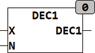

<!--
  Copyright (c) 2026 Hans Mühlbauer, Franz Höpfinger and others.

  This program and the accompanying materials are made available under the
  terms of the Eclipse Public License 2.0 which is available at
  https://www.eclipse.org/legal/epl-2.0

  SPDX-License-Identifier: EPL-2.0
-->

## Type	Function: INT

| | |
|:---|:---|
| **Input	INT** | X (number of values X can be) |
| **N** | INT (the variable which is incremented) |
| **Output** | INT (  Return Value  ) |
| | DEC1 counts the variable X from N-1 to 0 and then starts again at N-1, so that exactly N different starting values are generated at N-1 through 0. |

