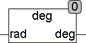

<!--
  Copyright (c) 2026 Hans Mühlbauer, Franz Höpfinger and others.

  This program and the accompanying materials are made available under the
  terms of the Eclipse Public License 2.0 which is available at
  https://www.eclipse.org/legal/epl-2.0

  SPDX-License-Identifier: EPL-2.0
-->

## DEG

| | |
|:---|:---|
| **Type	Function** | REAL |
| **Input	Rad** | REAL (angle in radians) |
| **Output** | REAL (angle in degrees) |
| | The function converts an angle value from radians to degrees. This takes into account the input may be not larger than 2.. If RAD is greater than 2, the equivalent to 2 is deducted until the input RAD is between 0 and 2. |
| **DEG(π) = 180 Grad,** | DEG(3π) = 180 Grad |
| **DEG(0) = 0 Grad,** | DEG(2π) = 0 Grad |

