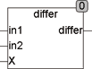

<!--
  Copyright (c) 2026 Hans Mühlbauer, Franz Höpfinger and others.

  This program and the accompanying materials are made available under the
  terms of the Eclipse Public License 2.0 which is available at
  https://www.eclipse.org/legal/epl-2.0

  SPDX-License-Identifier: EPL-2.0
-->

## DIFFER

| | |
|:---|:---|
| **Type	Function** | BOOL |
| **Input	IN1** | REAL (value 1) |
| **IN2** | REAL (value 2) |
| **X** | REAL (minimum difference in1 to in2) |
| **Output** | BOOL (TRUE if in1 and in2 differ by more than x from each other	) |
| | The function DIFFER is TRUE if in1 and in2 differ by more than X from each other. |




**Example:**

```iecst
Differ(100, 120, 10) returns TRUE Differ(100,110,15) returns FALSE
```
