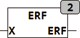

<!--
  Copyright (c) 2026 Hans Mühlbauer, Franz Höpfinger and others.

  This program and the accompanying materials are made available under the
  terms of the Eclipse Public License 2.0 which is available at
  https://www.eclipse.org/legal/epl-2.0

  SPDX-License-Identifier: EPL-2.0
-->

## Type	Function: REAL

| | |
|:---|:---|
| **Input	X** | REAL (input) |
| **Output** | REAL (result) |
| | The ERF function calculates the error function of X. The error function is calculated using an approximation formula, the maximum relative error is smaller than 1,3 * 10-4  . |

