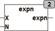

<!--
  Copyright (c) 2026 Hans Mühlbauer, Franz Höpfinger and others.

  This program and the accompanying materials are made available under the
  terms of the Eclipse Public License 2.0 which is available at
  https://www.eclipse.org/legal/epl-2.0

  SPDX-License-Identifier: EPL-2.0
-->

## Type	Function: REAL

| | |
|:---|:---|
| **Input	X** | REAL (input) |
| **N** | INT (exponential) |
| **Output** | REAL (result X^N) |
| | EXPN calculates the exponential value of X^N for integer N. EXPN is especifically written for PLC without  Floating  Point  Unit  and is about 30 times faster than the IEC standard function EXPT(). Note the special case of the 0^0 defined mathematically as a 1 and is not a 0. |
| **EXPN(10,-2) = 0.01** | EXPN(1.5,2) = 2.25 |
| | EXPN(0,0) = 1 |

