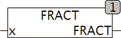

<!--
  Copyright (c) 2026 Hans Mühlbauer, Franz Höpfinger and others.

  This program and the accompanying materials are made available under the
  terms of the Eclipse Public License 2.0 which is available at
  https://www.eclipse.org/legal/epl-2.0

  SPDX-License-Identifier: EPL-2.0
-->

## Type	Function: REAL

| | |
|:---|:---|
| **Input	 X** | REAL (input) |
| **Output** | REAL (fractional part of X) |
| | The function  Fract returns the fractional part of X  . |



**Example:**

```iecst
FRACT(3.14)
```

results 0.14. For X greater than or less than +/- 2.14 * 10^9 Fract always provides a zero return. As the resolution of a 32bit REAL is a maximum of 8 digits, from numbers larger or smaller than +/- 2.14 * 10^9 no fractional part can be determined, because this part can also not be stored in a REAL variable.
