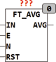
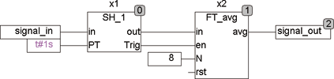

<!--
  Copyright (c) 2026 Hans Mühlbauer, Franz Höpfinger and others.

  This program and the accompanying materials are made available under the
  terms of the Eclipse Public License 2.0 which is available at
  https://www.eclipse.org/legal/epl-2.0

  SPDX-License-Identifier: EPL-2.0
-->

## Type	Function module

| | |
|:---|:---|
| **Input	IN** | REAL (input signal) |
| **E** | BOOL (enable input) |
| **N** | INT (number of values over which the average is calculated) |
| **RST** | BOOL (Reset input) |
| **Output** | REAL (moving average over the last N values) |
| | The function module FT_AVG calculates a moving average over each of the last N values. By the input RST, the stored values can be deleted. N is defined from 0 .. 32. N = 0 means that the output signal = input signal. N = 5 is the average over the last 5 values. The average is calculated over a maximum of 32 values. With input E can be control when the input is read. This allows a simple way  to connect a sample  and a hold module, such as SH_1 with FT_AVG can be linked. The first call to FT_AVG the buffer load the input signal to avoid that a Ramp-up  takes place. |
| | The following example reads SH_1 once a second the input value Signal_In and passes these values once per second to FT_AVG, which then forms out of the last 8 values the mean value. |

