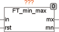

<!--
  Copyright (c) 2026 Hans Mühlbauer, Franz Höpfinger and others.

  This program and the accompanying materials are made available under the
  terms of the Eclipse Public License 2.0 which is available at
  https://www.eclipse.org/legal/epl-2.0

  SPDX-License-Identifier: EPL-2.0
-->

## Type	Function module

| | |
|:---|:---|
| **Input	IN** | REAL (input signal) |
| **RST** | BOOL (Reset input) |
| **Output	MX** | REAL (maximum value of the input signal) |
| **MN** | REAL (minimum value of the input signal) |
| | FT_MIN_MAX stores the minimum and maximum value of an input signal IN and provides these two values at the outputs of MN and MX until cleared by a reset. A reset sets MN and MX on the reset applied input values. |

