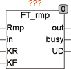

<!--
  Copyright (c) 2026 Hans Mühlbauer, Franz Höpfinger and others.

  This program and the accompanying materials are made available under the
  terms of the Eclipse Public License 2.0 which is available at
  https://www.eclipse.org/legal/epl-2.0

  SPDX-License-Identifier: EPL-2.0
-->

## Type	Function module

| | |
|:---|:---|
| **Input	RMP** | BOOL (  Enable  Signal) |
| **IN** | REAL (input signal) |
| **KR** | REAL (rate of increase in 1 / seconds) |
| **TV** | REAL (speed of the drop in 1 / seconds) |
| **Output	OUT_MAX** | REAL (upper output limit) |
| **BUSY** | BOOL (Indicates if the output rises or falls) |
| **UD** | BOOL (TRUE, when output is rising and false if 	Output drops) |
| | The output OUT follows the input with a linear ramp with defined rise and fall speed (KR and KF). K = 1 means that the output increases with 1 unit per second, or falls. The K factor must be greater than 0. The output of UD is TRUE if the output is rising and FALSE if it drops. When the output reaches the input value is BUSY FALSE, otherwise BUSY is TRUE and indicates that a rising or falling ramp is active. |
| | The output follows the input signal as long as the rise and fall speed of the input signal is smaller than that by KR and KF defined maximum increase or decrease speed. Changing the input signal faster, the output runs at the speed of KR or KF after the input signal. The ramp generation is real-time, which means that FT_RMP calculates every time where the output should be and sets this value to the output. The main change is therefore dependent on the cycle time and is not in equal steps. If a ramp out of sheer same steps are required, are the modules RMP_B and RMP_W are available. The module is only active when the input RMP = TRUE. |
| **The following chart shows the profile of the output as a function of an input signal** |  |

