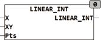

<!--
  Copyright (c) 2026 Hans Mühlbauer, Franz Höpfinger and others.

  This program and the accompanying materials are made available under the
  terms of the Eclipse Public License 2.0 which is available at
  https://www.eclipse.org/legal/epl-2.0

  SPDX-License-Identifier: EPL-2.0
-->

## LINEAR_INT

| | |
|:---|:---|
| **Type** | Function |
| **Input	X** | REAL (input) |
| **XY** | ARRAY [1..20,0..1] (Ascending sorted values pairs) |
| **PTS** | INT (number of pairs of values) |
| **Output** | REAL (output) |
| | LINEAR_INT is a linear interpolation module. A characteristic is described by a maximum of 20 coordinate values (X, Y)  and is cut up to 19 linear segments. The definition of the coordinate values is passed in an array which describes the characteristic with individual X, Y describes value pairs.  The value pairs must be sorted by the x_value. If an X value is called outside range which is described by the value pairs, then the first respective last linear segment is extrapolated and the corresponding value Issued. To keep the number of definition points flexible, at the input PTS is given the number of points. The possible score is in the range from 3 to 20, wherein each individual dot is shown with X-and Y-value. |



**Example:**

```iecst
VAR EXAMPLE : ARRAY[1..20,0..1] := -10,-0.53, 10,0.53, 100,88.3, 200,122.2; END_VAR
```

for the above definition, the following results are valid: LINEAR_INT (0, EXAMPLE, 4) = 0; LINEAR_INT (30.0, EXAMPLE, 4) = 20.0344; LINEAR_INT (66.41, EXAMPLE, 4) = 55.54229; LINEAR_INT (66.41, EXAMPLE, 4) = 55.54229;
