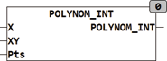

<!--
  Copyright (c) 2026 Hans Mühlbauer, Franz Höpfinger and others.

  This program and the accompanying materials are made available under the
  terms of the Eclipse Public License 2.0 which is available at
  https://www.eclipse.org/legal/epl-2.0

  SPDX-License-Identifier: EPL-2.0
-->

## POLYNOM_INT

| | |
|:---|:---|
| **Type** | Function |
| **Input	X** | REAL (input) |
| **XY** | ARRAY [1..5,0..1] (Ascending sorted values pairs) |
| **PTS** | INT (number of pairs of values) |
| **Output** | REAL (output) |
| | POLYNOM_INT interpolates a number of pairs of values with a polynomial of N times degree. The number of pairs is PTS, and N is the number of pairs of values (PTS). Any characteristic is described by a maximum of 5 coordinate-values (X, Y) and internally described by a polynomial. The definition of the coordinate values is passed in an array which describes the characteristic with individual X, Y describes value pairs.  The value pairs must be sorted by the x_value. If an X value is queried outside the described range by value-apairs, so that is calculated according to the determined polygon. It is noted, that here can occur oscillations above and below the area of definition by a polynomial of  higher degree , and calculated values mostly are not useful in this area. Before the application of a polynomial it is essential for this purpose to read the basics, for example, in Wikipedia. To keep the number of definition points flexible, at the input PTS is given the number of points. The possible score is in the range from 3 to 5, wherein each individual dot is shown with X-and Y-value. A  Polynomial  with more than 5 points leads to an increased tendency to oscillate and is for this reason refused. |
| **The following example shows the definition for the array XY and some values** |  |
| | VAR |




**Example:**

```iecst
EXAMPLE : ARRAY[1..5,0..1] := -10,-0.53, 10,0.53, 100,88.3, 200,122.2; END_VAR for the above definition, the following results are valid: POLYNOM_INT(0, example, 4) = -1.397069; POLYNOM_INT(30.0, example, 4) = 11.4257; POLYNOM_INT(66.41, example, 4) = 47.74527; POLYNOM_INT(800.0, example, 4) = -19617.94; When the results of the example is clearly seen that the value of -19617.94 for the input X = 800 makes no sense, since it is outside the defined range of -10 to +200. The following  trace  recording shows the variation of output to input. Here, clearly, the overshoot of the polygon with respect to a linear interpolation can be seen. Green = input X, Red = linear interpolation, Blue = polynomial interpolation.
```
