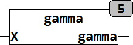

<!--
  Copyright (c) 2026 Hans Mühlbauer, Franz Höpfinger and others.

  This program and the accompanying materials are made available under the
  terms of the Eclipse Public License 2.0 which is available at
  https://www.eclipse.org/legal/epl-2.0

  SPDX-License-Identifier: EPL-2.0
-->

## GAMMA

| | |
|:---|:---|
| **Type	Function** | REAL |
| **Input	X** | REAL (input) |
| **Output** | REAL (Gamma function) |
| | The function GAMMA calculates the gamma function after approximation of NEMES. |
| | The gamma function can be used for Integer X as replacement for the Faculty. |

