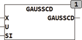

<!--
  Copyright (c) 2026 Hans Mühlbauer, Franz Höpfinger and others.

  This program and the accompanying materials are made available under the
  terms of the Eclipse Public License 2.0 which is available at
  https://www.eclipse.org/legal/epl-2.0

  SPDX-License-Identifier: EPL-2.0
-->

## GAUSSCD

| | |
|:---|:---|
| **Type	Function** | REAL |
| **Input	X** | REAL (input) |
| **U** | REAL (locality of the function) |
| **SI** | REAL (Sigma, spreading the function) |
| **Output** | REAL (Gaussian distribution function) |
| **The function GAUSSCD calculated the distribution function for normal distribution using the following formula** |  |
| | The normal distribution is the density function normally distributed random variables. With the parameters U = 0 and SI = 1, it follows the standard normal distribution. The distribution function ( Cumulative Distribution Function ). |

