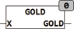
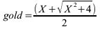

<!--
  Copyright (c) 2026 Hans Mühlbauer, Franz Höpfinger and others.

  This program and the accompanying materials are made available under the
  terms of the Eclipse Public License 2.0 which is available at
  https://www.eclipse.org/legal/epl-2.0

  SPDX-License-Identifier: EPL-2.0
-->

## GOLD

| | |
|:---|:---|
| **Type	Function** | REAL |
| **Input	X** | REAL (input) |
| **Output** | REAL (result of the Golden function) |
| | GOLD calculates the result of the golden feature. GOLD (1) gives the golden ratio, and GOLD (0) returns 1. GOLD (X) * GOLD (-X) is always 1. GOLD (X) is the positive result of the quadratic equation and -GOLD(-X) is the negative result of the quadratic equation. |
| **The calculation is done using the formula** |  |

