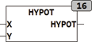
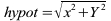

<!--
  Copyright (c) 2026 Hans Mühlbauer, Franz Höpfinger and others.

  This program and the accompanying materials are made available under the
  terms of the Eclipse Public License 2.0 which is available at
  https://www.eclipse.org/legal/epl-2.0

  SPDX-License-Identifier: EPL-2.0
-->

## HYPOT

| | |
|:---|:---|
| **Type	Function** | REAL |
| **Input	X** | REAL (X - value) |
| **Y** | REAL (Y - value) |
| **Output** | REAL (length of the hypotenuse) |
| | The Mortgage function calculates the hypotenuse of a right triangle, by the theorem of Pythagoras. |

