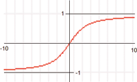

<!--
  Copyright (c) 2026 Hans Mühlbauer, Franz Höpfinger and others.

  This program and the accompanying materials are made available under the
  terms of the Eclipse Public License 2.0 which is available at
  https://www.eclipse.org/legal/epl-2.0

  SPDX-License-Identifier: EPL-2.0
-->

## LANGEVIN

| | |
|:---|:---|
| **Type	Function** | REAL |
| **Input	X** | REAL (input) |
| **Output** | REAL (output value) |
| | The  The Langevin  Function is very similarto sigmoid function, but more slowly approaching the limits. In contrast to the sigmoid   are the values at -1 and +1. The Langevin function is mainly at CPUs without floating point unit much faster than the  Sigmoid function. |
| **The following chart shows the progress of the Langevin function** |  |

