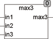

<!--
  Copyright (c) 2026 Hans Mühlbauer, Franz Höpfinger and others.

  This program and the accompanying materials are made available under the
  terms of the Eclipse Public License 2.0 which is available at
  https://www.eclipse.org/legal/epl-2.0

  SPDX-License-Identifier: EPL-2.0
-->

## MAX3

| | |
|:---|:---|
| **Type	Function** | REAL |
| **Input	IN1** | REAL (input 1) |
| **IN2** | REAL (input 2) |
| **IN3** | REAL (input 3) |
| **Output** | REAL (maximum of 3 inputs) |
| | The function  MAX3 delivers the maximum value of 3 inputs. Basically, the in standard IEC61131-3 contained function MAX should be equipped with a variable number of inputs. However, since in some systems   the MAX function is supported only two inputs, the function MAX3 is offered. |



**Example:**

```iecst
MAX3(1,3,2) = 3.
```
