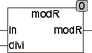

<!--
  Copyright (c) 2026 Hans Mühlbauer, Franz Höpfinger and others.

  This program and the accompanying materials are made available under the
  terms of the Eclipse Public License 2.0 which is available at
  https://www.eclipse.org/legal/epl-2.0

  SPDX-License-Identifier: EPL-2.0
-->

## MODR

| | |
|:---|:---|
| **Type	Function** | REAL |
| **Input	IN** | REAL (Dividend) |
| **DIVI** | REAL (divisor) |
| **Output** | REAL (remainder of division) |
| | The function  MODR returns the remainder of a division similar to the standard MOD function, but for REAL numbers. MODR internally uses the data format of type DINT. This may come to an overflow because DINT can store a maximum of +/-2.14 * 10^9 The range of MODR is therefore limited to +/- 2.14 * 10^9. For DIVI = 0  the function returns 0. |
| | MODR(A, M) = A - M * FLOOR2(A / M). |



**Example:**

```iecst
MODR(5.5, 2.5) result 0.5.
```
