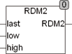

<!--
  Copyright (c) 2026 Hans Mühlbauer, Franz Höpfinger and others.

  This program and the accompanying materials are made available under the
  terms of the Eclipse Public License 2.0 which is available at
  https://www.eclipse.org/legal/epl-2.0

  SPDX-License-Identifier: EPL-2.0
-->

## RDM2

| | |
|:---|:---|
| **Type	Function** | INT |
| **Input	LAST** | INT (last calculated value) |
| **LOW** | INT (lowest generated value) |
| **HIGH** | INT (highest generated value) |
| **Output** | INT (random number between LOW and HIGH) |
| | RDM2 generates an integer  random  value in the range from LOW to HIGH, where LOW and HIGH are being included in the range of values. If the function is used only once per cycle, the input value LAST can remain at 0. The function RDM2 used the PLC internal time base to generate the random number. Since RDM2 uses LAST, an integer which represents the final result between LOW and HIGH, it can lead to a situation, in which the result RDM2 always produces the same result, as long as PLC  Timer  does not change in a cycle.  This most often happens, if the result is identical to the start value. Since then, the same start value will be reused within the same cycle again, and the result is the same. This occurs more often, depending on, if the specific area of LOW and HIGH is smaller for the result. One can avoid this effect easily by using as a starting value of loop counter which definitely uses each time a new value, or better yet add a loop counter with the final result used as initial value. |

