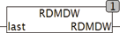

<!--
  Copyright (c) 2026 Hans Mühlbauer, Franz Höpfinger and others.

  This program and the accompanying materials are made available under the
  terms of the Eclipse Public License 2.0 which is available at
  https://www.eclipse.org/legal/epl-2.0

  SPDX-License-Identifier: EPL-2.0
-->

## RDMDW

| | |
|:---|:---|
| **Type	Function** | DWORD |
| **Input	LAST** | DWORD (last calculated value) |
| **Output** | DWORD (Random Pattern) |
| | RDMDW charges  pseudo  -  random number with 32 bits in length in the format DWORD. This is the PLC's internal  timer  that is read and is transferred into a  pseudo  random number. Since RDMDW as a function and was not written as a function module, it can not save data between 2 calls and should therefore be used with caution. If RDMDW called only once per cycle, it produces reasonable good results. But when it is repeatedly called within a cycle, it delivers the same number, most likely because of the PLC  timer  is still on the same value. If the function is repeatedly used within a cycle, so it must be passed with each call a different number of starts (LAST). If it be called only once per cycle, it is sufficient to call RDMDW(0). As a starting number for each call, the last number accounted by RDMDW be used. That result from RDMDW is a random 32-bit wide bit pattern. |

