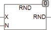

<!--
  Copyright (c) 2026 Hans Mühlbauer, Franz Höpfinger and others.

  This program and the accompanying materials are made available under the
  terms of the Eclipse Public License 2.0 which is available at
  https://www.eclipse.org/legal/epl-2.0

  SPDX-License-Identifier: EPL-2.0
-->

## RND

| | |
|:---|:---|
| **Type	Function** | REAL |
| **Input	X** | REAL (input) |
| **N** | integer (number of digits) |
| **Output** | REAL (rounded value) |
| | The function R  ND rounds the input value IN to N digits. Follows the last point a number that is greater than 5, the last digit is rounded up. RND internally uses the standard function TRUNC() which converts the input value to an INTEGER type DINT. This may come as an overflow because DINT can store in maximum +/-2.14*10^9. The range of the RND is therefore limited to +/-2.14*10^9 . See also the ROUND function which rounds the input value to N decimal places. |



**Example:**

```iecst
RND(355.55, 2) = 360 RND(3.555, 2) = 3.6 ROUND(3.555, 2) = 3.56
```
